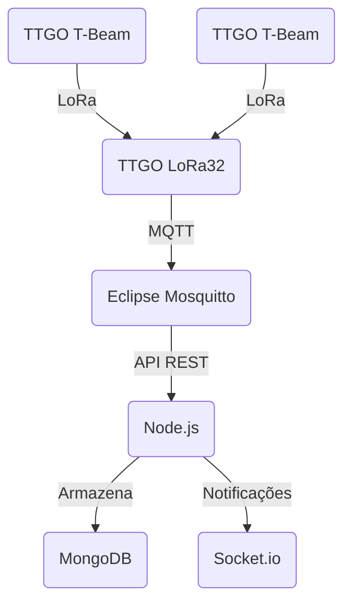

# 📡 Monitoramento e Rastreamento de Bovinos com IoT

Este projeto descreve como configurar um **servidor MQTT** para **monitoramento e rastreamento de bovinos** utilizando dispositivos **IoT**. A arquitetura é composta por **Nodes** e um **Gateway**, responsáveis pela coleta e transmissão de dados via **LoRa**. O servidor é implementado com **Node.js**, utilizando **Eclipse Mosquitto** como broker MQTT e **MongoDB** para armazenamento. O sistema oferece uma **API REST segura** com autenticação **JWT** e comunicação criptografada com **TLS/SSL**. Além disso, suporta **notificações em tempo real** via **Socket.io**.

## ⚙️ Arquitetura do Sistema

### **Nodes**

Os **Nodes** são responsáveis por **coletar dados fisiológicos e comportamentais** dos bovinos monitorados e enviá-los ao **Gateway** utilizando LoRa. Cada Node utiliza a placa **TTGO T-Beam**, equipada com um ESP32 e módulo GPS.

- **Placa Utilizada**:

  - **TTGO T-Beam (ESP32)**: Oferece baixo consumo de energia e um módulo GPS integrado, ideal para monitoramento em tempo real.

- **Dados Coletados**:

  - **Frequência Cardíaca (FC)**
  - **Temperatura Superficial Corporal (TSC)**
  - **Comportamento**: Pastagem, ócio e movimentação
  - **Localização**: Latitude, longitude, altitude e velocidade

- **Transmissão dos Dados**:

  - Utiliza a tecnologia **LoRa** (Long Range) para enviar os dados ao Gateway, garantindo uma comunicação eficiente em áreas rurais.

- **Processamento Local**:
  - Conversão de sinais analógicos para digitais e filtragem de dados irrelevantes, reduzindo o volume de transmissão para o Gateway.

### **Gateway**

O **Gateway** é responsável por receber os dados dos Nodes e encaminhá-los para a **nuvem** por meio de um **Broker MQTT**, permitindo o monitoramento remoto. Ele utiliza a placa **TTGO LoRa32**, equipada com ESP32 e módulo LoRa.

- **Placa Utilizada**:

  - **TTGO LoRa32 (ESP32)**: Possui um módulo LoRa integrado para comunicação com os Nodes e conectividade com a internet.

- **Função de Interface**:

  - Conecta a rede **LoRa** dos Nodes à **internet**, utilizando o protocolo **MQTT** para enviar dados ao servidor.

- **Recepção e Encaminhamento**:

  - Coleta os dados dos Nodes, agrega ou filtra informações, e os envia para o **broker MQTT** na nuvem.

- **Conectividade**:
  - O Gateway é alimentado por uma fonte contínua e conectado à internet para garantir **funcionamento contínuo** e comunicação em tempo real.

## 🔄 Fluxo de Dados

1. Os dispositivos TTGO T-Beam coletam e enviam dados via LoRa para o Gateway.
2. O Gateway retransmite os dados para o Broker MQTT.
3. O Broker encaminha as mensagens para o Backend.
4. O Backend processa e armazena os dados no MongoDB.
5. Notificações em tempo real são enviadas para os clientes via Socket.io.

## 🚀 Resumo da Arquitetura



## 🛠️ Tecnologias e Componentes Utilizadas (Geral)

### Tecnologias

- **Backend**:

  - **Node.js** para a API e comunicação com o broker MQTT
  - **Eclipse Mosquitto** como broker MQTT
  - **MongoDB** para armazenamento de dados
  - **JWT** para autenticação segura
  - **Socket.io** para notificações em tempo real

- **Comunicação**:
  - **LoRa** para transmissão entre Nodes e Gateway
  - **MQTT** para envio de dados do Gateway ao servidor

### Componentes

1. **Dispositivos TTGO T-Beam**:

   - 🌍 Enviam dados de localização via **LoRa**.

2. **Gateway TTGO LoRa32**:

   - 🔗 Recebe os dados dos dispositivos e os retransmite para o broker.

3. **Broker MQTT (Eclipse Mosquitto)**:

   - 📥 Intermediário que recebe mensagens do gateway e as distribui para o backend.

4. **Backend (Node.js)**:

   - ⚙️ Processa dados, armazena informações em um banco de dados e envia notificações em tempo real.

5. **Banco de Dados (MongoDB)**:

   - 💾 Armazena os dados de rastreamento de forma estruturada.

6. **Cliente (Socket.io)**:
   - 📲 Recebe notificações em tempo real sobre a localização dos bois.

## Índice

1. [Funcionalidades](#funcionalidades)
2. [Tecnologias Utilizadas](#tecnologias-utilizadas)
3. [Requisitos](#requisitos)
4. [Instalação das Dependências](#instalação-das-dependências)
   - [1. Instalar Node.js e npm](#1-instalar-nodejs-e-npm)
   - [2. Instalar e Configurar o MongoDB](#3-instalar-e-configurar-o-mongodb)
   - [3. Instalar o Mosquitto MQTT Broker](#4-instalar-o-mosquitto-mqtt-broker)
   - [4. Instalar Dependências Node.js](#6-instalar-dependências-nodejs)
5. [Configuração do Broker MQTT (Mosquitto)](#configuração-do-broker-mosquitto)
6. [Configuração do TLS/SSL](#configuração-do-tlsssl)
7. [Execução do Servidor](#execução-do-servidor)
   - [Iniciar o Broker Mosquitto](#iniciar-o-broker-mosquitto)
8. [Uso](#uso)
   - [1. Registro de Usuário](#1-registro-de-usuário)
   - [2. Login](#2-login)
   - [3. Acessar Rotas Protegidas](#3-acessar-rotas-protegidas)
   - [4. Publicar Mensagem MQTT](#4-publicar-mensagem-mqtt)
   - [5. Obter Dados Armazenados](#5-obter-dados-armazenados)
9. [Considerações Finais](#considerações-finais)
10. [Recursos Adicionais](#recursos-adicionais)

## Funcionalidades

- **Registro e Login de Usuários:** Criação e autenticação de usuários utilizando JWT.
- **API REST Segura:** Endpoints protegidos para acessar status, dados e publicar mensagens.
- **Comunicação MQTT Segura:** MQTT sobre TLS/SSL com autenticação de clientes via certificados.
- **Notificações em Tempo Real:** Utiliza Socket.io para enviar eventos em tempo real para clientes conectados.
- **Backups Automatizados do MongoDB:** Realiza backups periódicos do banco de dados.
- **Documentação com Swagger:** Documentação interativa da API disponível via Swagger UI.
- **Testes Automatizados com Jest:** Testes automatizados para garantir a qualidade do código.

## Tecnologias Utilizadas

- **Node.js & Express:** Backend da aplicação.
- **Eclipse Mosquitto:** Broker MQTT.
- **MongoDB & Mongoose:** Banco de dados e ORM.
- **Socket.io:** Comunicação em tempo real.
- **JWT:** Autenticação segura.
- **Swagger:** Documentação da API.
- **Jest & Supertest:** Testes automatizados.
- **OpenSSL:** Geração de certificados SSL.

## Requisitos

- **Sistema Operacional:** Windows 10 ou superior
- **Privilégios Administrativos:** Necessários para instalar software e configurar serviços
- **Conexão com a Internet:** Para baixar pacotes e bibliotecas

## Instalação das Dependências

### 1. Instalar Node.js e npm

1. **Baixar Node.js:**

   - Acesse [nodejs.org](https://nodejs.org/en/download/) e baixe a versão LTS mais recente do Node.js.

2. **Instalar Node.js:**

   - Execute o instalador baixado.
   - Siga as instruções na tela e certifique-se de que a opção **"Automatically install necessary tools"** esteja marcada.

3. **Verificar Instalação:**
   - Abra o **Prompt de Comando** (`cmd`) e execute:
     ```bash
     node --version
     npm --version
     ```
   - Ambos os comandos devem retornar as versões instaladas do Node.js e do npm.

### 2. Instalar e Configurar o MongoDB

1. **Baixar MongoDB:**

   - Acesse [MongoDB Download Center](https://www.mongodb.com/try/download/community) e baixe o instalador MSI para Windows.

2. **Instalar MongoDB:**

   - Execute o instalador MSI.
   - Durante a instalação, selecione **"Complete"** para uma instalação padrão.
   - Marque a opção **"Install MongoDB as a Service"** para que o MongoDB inicie automaticamente com o Windows.

3. **Verificar Instalação:**
   - Abra o **Prompt de Comando** e execute:
     ```bash
     mongod --version
     ```
   - Deve exibir a versão do MongoDB instalada.

### 3. Instalar o Mosquitto MQTT Broker

1. **Baixar Mosquitto:**

   - Acesse [Mosquitto Downloads](https://mosquitto.org/download/) e baixe o instalador para Windows.

2. **Instalar Mosquitto:**

   - Execute o instalador MSI.
   - Durante a instalação, selecione a opção **"Install service as default"** para instalar o Mosquitto como um serviço do Windows.
   - Opcionalmente, instale os clientes Mosquitto (`mosquitto_pub` e `mosquitto_sub`) para testes.

3. **Verificar Instalação:**
   - Abra o **Prompt de Comando** e execute:
     ```bash
     mosquitto -v
     ```
   - Deve exibir a versão do Mosquitto instalada.

### 4. Instalar Dependências Node.js

Navegue até o diretório do projeto Node.js e execute:

```bash
npm install
```

## Configuração do Broker Mosquitto

Para garantir que apenas dispositivos autorizados possam se conectar ao broker MQTT, configuraremos autenticação básica.

1. **Criar Arquivo de Senhas:**

   Abra o **Prompt de Comando** e execute:

   ```bash
   mosquitto_passwd -c "C:\Program Files\mosquitto\config\passwd.txt" usuario1
   ```

   Será solicitado que você defina uma senha para `usuario1`.

   Você pode repetir esse processo para adicionar mais usuários, omitindo a opção `-c` para não sobrescrever o arquivo:

   ```bash
   mosquitto_passwd "C:\Program Files\mosquitto\config\passwd.txt" usuario2
   ```

2. **Configurar o Mosquitto para Usar Autenticação:**

   - Navegue até o diretório de configuração do Mosquitto, geralmente localizado em `C:\Program Files\mosquitto\config\`.
   - Abra ou crie o arquivo `mosquitto.conf` com um editor de texto (por exemplo, Notepad).
   - Adicione as seguintes linhas para habilitar a autenticação:

     ```
     allow_anonymous false
     password_file C:\Program Files\mosquitto\config\passwd.txt
     ```

   - **Opcional:** Para configurar TLS/SSL, siga a [documentação oficial do Mosquitto](https://mosquitto.org/man/mosquitto-conf-5.html) para adicionar certificados.

3. **Reiniciar o Serviço Mosquitto:**

   Abra o **Prompt de Comando** como **Administrador** e execute:

   ```bash
   net stop mosquitto
   net start mosquitto
   ```

   Alternativamente, reinicie o serviço via **Serviços do Windows**:

   - Pressione `Win + R`, digite `services.msc` e pressione Enter.
   - Encontre **Mosquitto Broker**, clique com o botão direito e selecione **Reiniciar**.

## Configuração do TLS/SSL

Para garantir comunicações seguras, é necessário configurar TLS/SSL tanto no broker Mosquitto quanto no servidor Node.js.

1. **Gerar Certificados SSL:**

   Utilize o OpenSSL para gerar certificados. Abra o **Prompt de Comando** e execute:

   ```bash
   openssl req -new -x509 -days 365 -nodes -out mosquitto.crt -keyout mosquitto.key
   ```

   Siga as instruções para preencher os detalhes do certificado.

2. **Configurar Mosquitto para Usar TLS/SSL:**

   Adicione as seguintes linhas no arquivo `mosquitto.conf`:

   ```
   listener 8883
   cafile C:\Path\To\mosquitto.crt
   certfile C:\Path\To\mosquitto.crt
   keyfile C:\Path\To\mosquitto.key
   ```

   Substitua `C:\Path\To\` pelo caminho real onde os certificados foram salvos.

3. **Configurar o Servidor Node.js para Usar TLS/SSL:**

   Assegure-se de que tanto o cliente MQTT quanto a API REST utilizem os certificados gerados para estabelecer conexões seguras.

## Execução do Servidor

### Iniciar o Broker Mosquitto

Abra o **Prompt de Comando** e execute:

```bash
mosquitto.exe -c "C:\Program Files\mosquitto\config\mosquitto.conf" -v
```

## Uso

### 1. Registro de Usuário

**Endpoint:**

```
POST /auth/register
```

**Corpo da Requisição:**

```json
{
  "username": "admin",
  "password": "admin_password"
}
```

### 2. Login

**Endpoint:**

```
POST /auth/login
```

**Corpo da Requisição:**

```json
{
  "username": "admin",
  "password": "admin_password"
}
```

**Resposta:**

```json
{
  "token": "seu_token_jwt"
}
```

### 3. Acessar Rotas Protegidas

Inclua o token JWT no cabeçalho `Authorization`:

```
Authorization: Bearer seu_token_jwt
```

### 4. Publicar Mensagem MQTT

**Endpoint:**

```
POST /data/publish
```

**Corpo da Requisição:**

```json
{
  "topic": "ttgo/device1/data",
  "message": {
    "temperatura": 25,
    "frequencia": 80,
    "latitude": -23.5505,
    "longitude": -46.6333
  }
}
```

### 5. Obter Dados Armazenados

**Endpoint:**

```
GET /data?topic=ttgo/device1/data
```

## Considerações Finais

### Melhorias e Boas Práticas

1. **Segurança:**

   - **TLS/SSL:** Implemente comunicação segura usando TLS/SSL para o broker MQTT e a API REST.
   - **Senhas Seguras:** Nunca armazene senhas em texto puro no código. Utilize variáveis de ambiente ou serviços de gerenciamento de segredos.
   - **Autorização Avançada:** Considere implementar níveis de permissão para diferentes usuários.

2. **Escalabilidade:**

   - **Banco de Dados:** MongoDB é adequado para muitos casos, mas para grandes volumes de dados, considere otimizações como índices ou bancos de dados alternativos.
   - **Broker MQTT:** Para um grande número de dispositivos, brokers como EMQX ou HiveMQ podem oferecer melhor desempenho e escalabilidade.

3. **Monitoramento e Logs:**

   - Utilize ferramentas de monitoramento para acompanhar a performance do servidor, uso de recursos e possíveis falhas.
   - Armazene logs de forma centralizada e implemente rotação de logs para evitar o consumo excessivo de espaço em disco.

4. **Automatização:**

   - Automatize o processo de inicialização do servidor utilizando ferramentas como **Task Scheduler** ou scripts de inicialização.
   - Considere usar contêineres (como Docker) para facilitar a implantação e isolamento do ambiente.

5. **Atualizações e Manutenção:**
   - Mantenha todas as dependências atualizadas para garantir segurança e desempenho.
   - Realize backups regulares do banco de dados MongoDB para evitar perda de dados.

### Boas Práticas de Desenvolvimento

- **Testes Automatizados:** Expanda os testes automatizados para cobrir mais funcionalidades e garantir a robustez da aplicação.

## Recursos Adicionais

- **Documentação do Mosquitto:** [https://mosquitto.org/documentation/](https://mosquitto.org/documentation/)
- **Documentação do MongoDB:** [https://docs.mongodb.com/](https://docs.mongodb.com/)
- **Arduino Libraries:**
  - [PubSubClient](https://pubsubclient.knolleary.net/)
  - [ArduinoJson](https://arduinojson.org/)
- **Swagger Documentation:** [https://swagger.io/docs/](https://swagger.io/docs/)
- **Socket.io Documentation:** [https://socket.io/docs/](https://socket.io/docs/)
